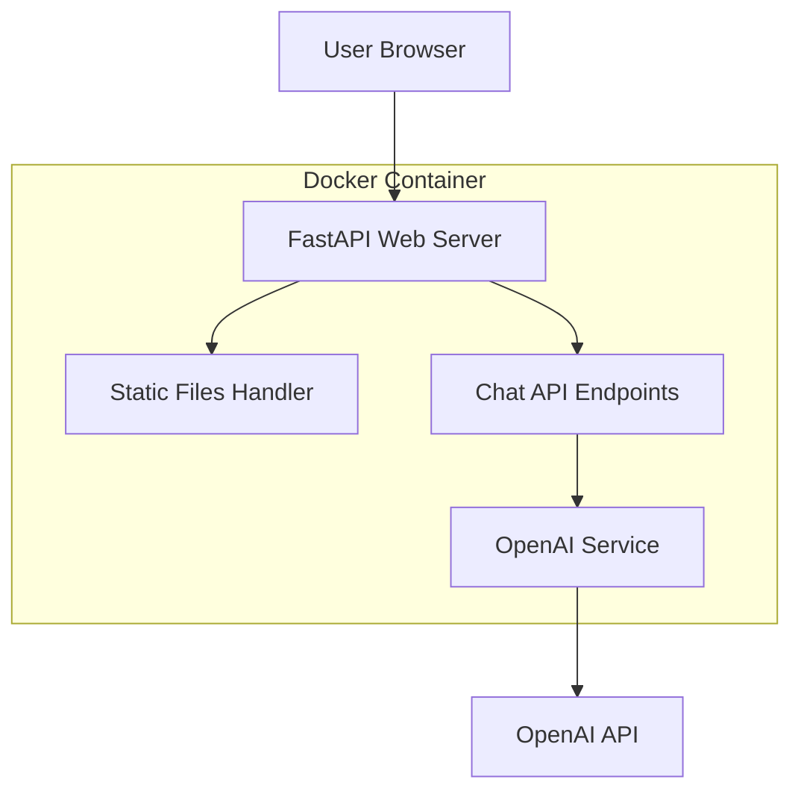

# Design Document

## Overview

The ChatGPT-like web UI will be built using FastAPI as the backend framework with HTML, CSS, and JavaScript for the frontend. FastAPI was chosen for its excellent performance, automatic API documentation, modern Python async support, and built-in WebSocket capabilities for real-time communication.

The application will maintain the existing OpenAI integration while adding a web layer that serves both static files and API endpoints. The design follows a simple client-server architecture where the frontend communicates with the backend via REST API calls.

## Architecture



### Technology Stack
- **Backend**: FastAPI (Python)
- **Frontend**: Vanilla HTML/CSS/JavaScript
- **Styling**: Modern CSS with Flexbox/Grid
- **HTTP Client**: Fetch API
- **Containerization**: Docker with docker-compose

## Components and Interfaces

### Backend Components

#### 1. FastAPI Application (`app/main.py`)
- Serves static HTML files
- Provides REST API endpoints for chat functionality
- Handles CORS for frontend-backend communication
- Integrates with existing OpenAI client

#### 2. Chat Service (`app/services/chat_service.py`)
- Encapsulates OpenAI API interaction logic
- Manages conversation context and message history
- Handles error scenarios and retries
- Provides clean interface for the API layer

#### 3. API Routes (`app/routes/chat.py`)
- `POST /api/chat` - Send message and get AI response
- `POST /api/chat/new` - Start new conversation
- `GET /api/health` - Health check endpoint

### Frontend Components

#### 1. Main HTML Structure (`static/index.html`)
- Chat container with message history
- Input form for user messages
- New chat button
- Loading indicators

#### 2. Styling (`static/style.css`)
- ChatGPT-inspired design with dark/light theme
- Responsive layout for mobile and desktop
- Message bubbles with proper spacing
- Loading animations and transitions

#### 3. JavaScript Logic (`static/script.js`)
- Message sending and receiving
- DOM manipulation for chat updates
- Error handling and user feedback
- Auto-scrolling and UI interactions

## Data Models

### Message Model
```python
class Message:
    role: str  # "user" or "assistant"
    content: str
    timestamp: datetime
```

### Chat Request Model
```python
class ChatRequest:
    message: str
    conversation_id: Optional[str] = None
```

### Chat Response Model
```python
class ChatResponse:
    message: str
    conversation_id: str
    success: bool
    error: Optional[str] = None
```

## Error Handling

### API Level
- Structured error responses with appropriate HTTP status codes
- Detailed error messages for debugging
- Graceful handling of OpenAI API failures
- Request validation and sanitization

### Frontend Level
- User-friendly error messages
- Retry mechanisms for failed requests
- Loading states and progress indicators
- Fallback UI states for error scenarios

### Error Types
1. **Network Errors**: Connection timeouts, network unavailable
2. **API Errors**: Invalid API key, rate limits, service unavailable
3. **Validation Errors**: Empty messages, invalid input
4. **Server Errors**: Internal server errors, configuration issues

## Testing Strategy

### Backend Testing
- Unit tests for chat service logic
- Integration tests for API endpoints
- Mock OpenAI API responses for testing
- Error scenario testing

### Frontend Testing
- Manual testing of UI interactions
- Cross-browser compatibility testing
- Responsive design testing on different screen sizes
- Error handling and edge case testing

### Docker Integration Testing
- Test complete docker-compose setup
- Verify environment variable handling
- Test volume mounting and live reload
- Validate port exposure and networking

## Implementation Notes

### FastAPI vs Flask Decision
FastAPI was chosen over Flask for the following reasons:
- **Performance**: Significantly faster due to async support
- **Modern Python**: Built-in support for type hints and async/await
- **Automatic Documentation**: Built-in Swagger/OpenAPI documentation
- **Validation**: Automatic request/response validation with Pydantic
- **WebSocket Support**: Native WebSocket support for future real-time features

### File Structure
```
app/
├── main.py              # FastAPI application entry point
├── services/
│   └── chat_service.py  # OpenAI integration service
├── routes/
│   └── chat.py          # API route handlers
├── models/
│   └── chat.py          # Pydantic models
└── static/
    ├── index.html       # Main HTML file
    ├── style.css        # Styling
    └── script.js        # Frontend JavaScript
```

### Docker Configuration Updates
- Update Dockerfile to install FastAPI dependencies
- Modify docker-compose.yml to expose web port (8000)
- Update command to run FastAPI with uvicorn
- Maintain existing environment variable handling