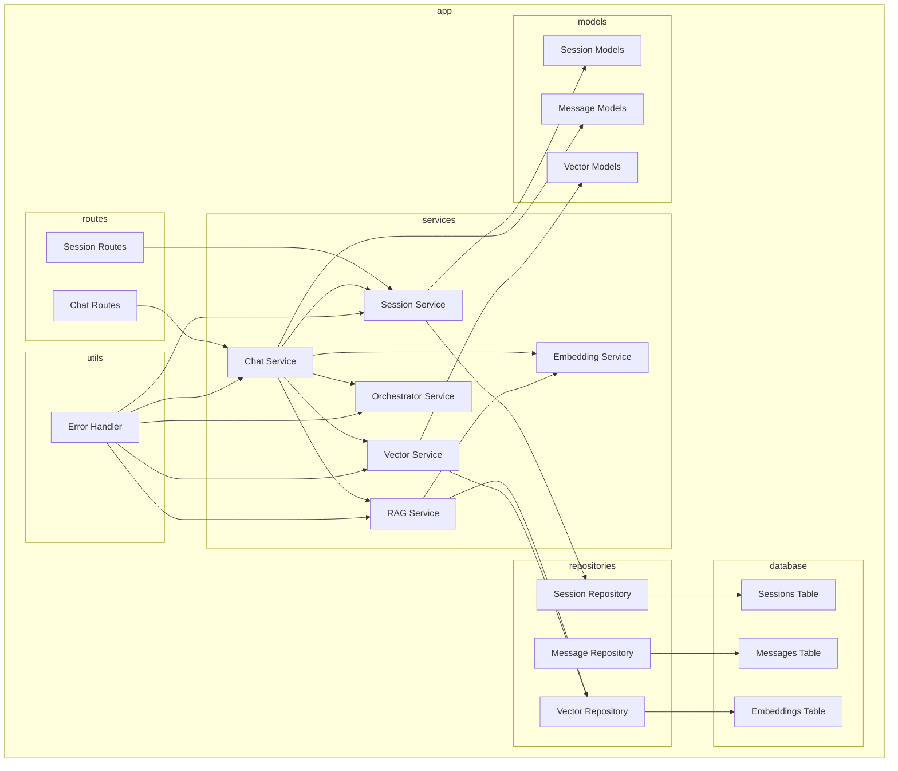

    

    <b>Automatic Architecture Diagrams from Code</b> 
    <a href="https://github.com/swark-io/swark">GitHub</a> • <a href="https://swark.io">Website</a> • <a href="mailto:contact@swark.io">Contact Us</a>

## Usage Instructions

1. **Render the Diagram**: Use the links below to open it in Mermaid Live Editor, or install the [Mermaid Support](https://marketplace.visualstudio.com/items?itemName=bierner.markdown-mermaid) extension.
2. **Recommended Model**: If available for you, use `claude-3.5-sonnet` [language model](vscode://settings/swark.languageModel). It can process more files and generates better diagrams.
3. **Iterate for Best Results**: Language models are non-deterministic. Generate the diagram multiple times and choose the best result.

## Generated Content
**Model**: GPT-4o - [Change Model](vscode://settings/swark.languageModel)  
**Mermaid Live Editor**: [View](https://mermaid.live/view#pako:eNqdlV1vwiAUhv9Kw7X-AS-WLNNsN2bJNLuxi8H2aJv0K0BNjPG_D_kSyiFm6xUHHjgHXl56JUVfAlmQvDsxOlTZdpl3mfz4eNAddBh0T9DL-lEAfwzcv6KiYq8Hdm-ynX2p9k9IceC87jsLbnQYs9CVSF4O7FwXaGYzpFNvdJDIbVGbHKcZPTny6_U9QZ2hED1z4LcKEyy0ByjLunusu7I9iRk9KyrgglE_x6fXiczDT47B0PNazqinp-cUkcRDD4tfJhW1EqAn0PRaB2nanI6CzdGgLF5zSQU9UA5ovXwvBxsnIs-29xCv1rKmXpx16ljaiRPzeL2jqJvJ4QJjcv8V7coG2G51j7IPHT1drpXWbBJiqTGn1lqRCaU0aqVCUSOTJo1OEeiKVA3d9DyfzecvgRPNQxL4XUETG3ormZ4_UJ5JE0Ro0AQUOTPBYX4M94lt4X79NeWV6xeXBhKFhZvCl_Kz--WY660h384KCh0TZHPM1CnmWvhXPXEbYgaVOcYinWMEEzqm_qegckbiTgQ-eyaPgciMtMBaWpfy33vNiaighZwsspyUcKRjI3Jyk9A4yDcQljWVL0JLFoKNMCN0FP3m0hU2ltY6VWRxpA2H2y-P_Zkj) | [Edit](https://mermaid.live/edit#pako:eNqdlV1vwiAUhv9Kw7X-AS-WLNNsN2bJNLuxi8H2aJv0K0BNjPG_D_kSyiFm6xUHHjgHXl56JUVfAlmQvDsxOlTZdpl3mfz4eNAddBh0T9DL-lEAfwzcv6KiYq8Hdm-ynX2p9k9IceC87jsLbnQYs9CVSF4O7FwXaGYzpFNvdJDIbVGbHKcZPTny6_U9QZ2hED1z4LcKEyy0ByjLunusu7I9iRk9KyrgglE_x6fXiczDT47B0PNazqinp-cUkcRDD4tfJhW1EqAn0PRaB2nanI6CzdGgLF5zSQU9UA5ovXwvBxsnIs-29xCv1rKmXpx16ljaiRPzeL2jqJvJ4QJjcv8V7coG2G51j7IPHT1drpXWbBJiqTGn1lqRCaU0aqVCUSOTJo1OEeiKVA3d9DyfzecvgRPNQxL4XUETG3ormZ4_UJ5JE0Ro0AQUOTPBYX4M94lt4X79NeWV6xeXBhKFhZvCl_Kz--WY660h384KCh0TZHPM1CnmWvhXPXEbYgaVOcYinWMEEzqm_qegckbiTgQ-eyaPgciMtMBaWpfy33vNiaighZwsspyUcKRjI3Jyk9A4yDcQljWVL0JLFoKNMCN0FP3m0hU2ltY6VWRxpA2H2y-P_Zkj)

